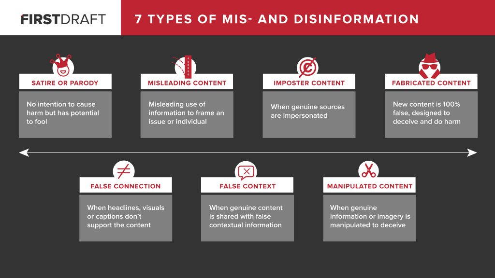

# Reddit: r/TheOnion vs. r/nottheonion
<a href="https://dawngraham.github.io/" target="_blank">Dawn Graham</a>

## Problem Statement

While "fake news" has become a hot topic in recent years, fake news is nothing new. The subreddits r/nottheonion and r/AteTheOnion point both to the interest in "strange but true" news and the challenge of separating fact from fiction. My goal is to use natural language processing to predict whether an article is from r/TheOnion (fake news) or from r/nottheonion (real news) by the title alone.

## Contents
Notebooks

- [00. Scrape Methods](./notebooks/00-scrape-methods.ipynb): Documentation of different scraping methods attempted.
- [01. Reddit Scraper](./notebooks/01-reddit-scraper.ipynb): Scraper used to data from Reddit using Pushshift.io API.
- [02. NLP & Classification Modeling](./notebooks/02-nlp-classification.ipynb): Includes EDA, natural language processing, classification modeling, and evaluation of selected model.

Data

- [cleaned_subreddits.csv](./data/cleaned_subreddits.csv): Final dataset
- [nottheonion\_181217_184009.csv](./data/nottheonion_181217_184009.csv): Posts scraped from Reddit r/nottheonion
- [TheOnion\_181217_184244.csv](./data/TheOnion_181217_184244.csv): Posts scraped from Reddit r/TheOnion

Presentation

- [Slides: r/TheOnion vs. r/nottheonion](https://docs.google.com/presentation/d/e/2PACX-1vRwXA6ccW92e2VnkJHtk1FE0_G4NV9mL-TFh8btra9H4k9qH8og6UhkX014CrC7MDk0ZZyIfbP_vsEO/pub?start=false&loop=false&delayms=3000) (Google Slideshow)

## Project Description
While "fake news" has become a hot topic in recent years, fake news is nothing new. It's also not new that truth is often stranger than fiction - sometimes real stories are hard to believe.
 
Researcher Claire Wardle categorized fake news into seven types:1

*The Onion* falls into the first type: satire or parody. The organization started publishing satirical news articles in print in 1988, then went online in 1996.2 Articles from *The Onion* and its satirical sister sites are shared on the Reddit subreddit **r/TheOnion**, which had 83.1k subscribers as of December 21, 2018.

There is also the subreddit **r/nottheonion**: "For true stories that are so mind-blowingly ridiculous that you could have sworn they were from The Onion." This had 14.5m subscribers, far outnumbering the subreddit for the publication it references.

Another subreddit **r/AteTheOnion** had 229k subscribers, also outnumbering subscribers to r/TheOnion. This one is dedicated to "screencaps of people who failed to see The Onion's articles as satire."  

r/nottheonion and r/AteTheOnion point both to the interest in "strange but true" news and the challenge of separating fact from fiction.  

This raises the question: **Can we use natural language processing to predict whether an article is from r/TheOnion (fake news) or from r/nottheonion (real news) by the title alone?**

## Data Collection & Processing
The data for this project was collected on December 17, 2018 using the pushshift.io API. It contains the 10,000 most recent submissions (at time of collection) to each subreddit, r/TheOnion and r/nottheonion.  

Submissions to r/TheOnion span from September 22, 2016 to December 17, 2018.  
Submissions to r/nottheonion span from October 26, 2018 to December 17, 2018.  

The shorter time span for r/nottheonion reflects both the larger subscriber base and the greater diversity of sources. People can submit news articles from any "original, reliable source" written in English, whereas r/TheOnion only accepts articles from *The Onion* or sister sites.3

After collection, the titles of each submission were processed according to the following steps:  

1. Accents were removed so words were not inappropriately split up. (For example, "Pokémon" being turned into "pok" and "mon.")
2. Punctuation was removed.
3. Capitalization was removed so that only lowercase words would be returned.
4. Words were lemmatized.
5. Stop words were removed.

From here, the data was split into training and testing data, then vectorized using `CountVectorizer()`.

### Data Dictionary
|Column|Type|Dataset|Description|
|---|---|---|---|
|clean_title|*object (string)*|cleaned_subreddits.csv|The processed title after lemmatization and removal of accents, punctuation, capitalization, and stop words.|
|is_onion|*int*|cleaned_subreddits.csv|Indicates which subreddit the title came from. 1: r/TheOnion 0: r/nottheonion|

## Model Evaluation
I got cross-validation and accuracy scores for Random Forest (using GridSearch), Logistic Regression, and Multinomial Naive Bayes models. Although Multinomial Naive Bayes performed slightly better than Logistic Regression (87.1% versus 86.8% testing accuracy), I selected Logistic Regression for interpretability.

### Selected Model Details  
**LogisticRegression(solver='liblinear')**  

|Metric|Value|
|-----|-----|
|Cross-validation score|85.54%|
|Training accuracy|97.27%|
|Testing accuracy|86.82%|
|Misclassification rate|13.18%|
|Recall / Sensitivity|86.36%|
|Specificity|87.28%|
|Precision|87.16%|

||predicted negative|predicted positive|  
|-----|-----|-----|  
|**actual negative**|2182|318|  
|**actual positive**|341|2159|

## Conclusions
This model was able to predict with 86.82% accuracy whether an article was from r/TheOnion or r/nottheonion by title alone.

The words that were more likely to be from titles in r/TheOnion were quiz, nation, blog, incredible, and tips. The words that were more likely to be from titles in r/nottheonion were poop, arrested, sues, says, and cops.

Some misclassifications could result from a title containing a word the model associates with the other subreddit. A closer look shows that such submissions may have also been removed from the given subreddit due to not following submission guidelines. Many of the other misclassifications also turned out to be removed from their given subreddits for a variety of reasons. This suggests that filtering out submissions that were removed from subreddits could help improve model accuracy.

However, many submissions are also removed from both r/TheOnion and r/nottheonion due to duplication. Being able to see these submissions can provide insight into subscriber interest in an article. In the case of r/nottheonion, it can also provide insight into what articles subscribers think are appropriate for the subreddit, even if they are ultimately removed. In the case of r/TheOnion, repeated postings of a satirical article can be related to real-world events.

Next steps:

- Take a deeper dive into understanding the misclassified titles.
- Try filtering out submissions that were removed from the subreddits.
- Look at how repeated postings in r/TheOnion relate to real news.

## An Invitation
Thoughts and feedback are always appreciated. Please feel free to get in touch. Get up-to-date contact info at [dawngraham.github.io](https://dawngraham.github.io/).

---
#### References
1. Wardle, Claire (16 February 2017). "Fake news. It’s complicated." *First Draft.* Retrieved 21 December 2018, from `https://firstdraftnews.org/fake-news-complicated/`.
2. Wikipedia contributors (19 December 2018). The Onion. *Wikipedia, The Free Encyclopedia.*  Retrieved 21 December 2018, from `https://en.wikipedia.org/wiki/The_Onion`.
3. "Welcome to NTO101: An Introduction to /r/NotTheOnion!" *Reddit.* Retrieved 21 December 2018, from `https://www.reddit.com/r/nottheonion/wiki/nto101`.